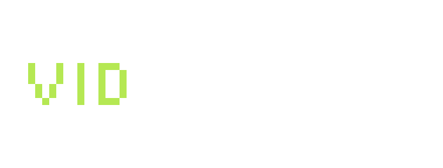

 

 
 

## Hello
I’m Vidmancer, the indie dev behind File Under Kingdom and Stellar Routes!

## Stellar Routes
Stellar Routes is a transportation management game set in space, where you can draw routes around planets to slingshot ships to their destination.

[Steam page](https://store.steampowered.com/app/3948490/Stellar_Routes/). 

[Press Kit](https://impress.games/press-kit/vidmancer/stellar-routes)

<iframe width="853" height="480" src="https://youtu.be/kLYNrF6ZSUA" title="YouTube video player" frameborder="0" allow="accelerometer; autoplay; clipboard-write; encrypted-media; gyroscope; picture-in-picture" allowfullscreen></iframe>

## File Under Kingdom
File Under Kingdom is a mix of city builder and puzzle game, with a story that changes with how you plan/build the kingdom. 

[Steam page](https://store.steampowered.com/app/1851120/File_Under_Kingdom/). 

<iframe width="853" height="480" src="https://www.youtube.com/embed/fAjBmZcs1X4" title="YouTube video player" frameborder="0" allow="accelerometer; autoplay; clipboard-write; encrypted-media; gyroscope; picture-in-picture" allowfullscreen></iframe>

    

## Socials
You can find me on

[Twitter](https://twitter.com/vidmancer)

[YouTube](https://www.youtube.com/channel/UCL1xD-gBE7MswqJX0s-bFpg)

[Discord](https://discord.gg/eBnHH4SKw5)

Or shoot me an email at 

info[at]vidmancer.com

 
 

